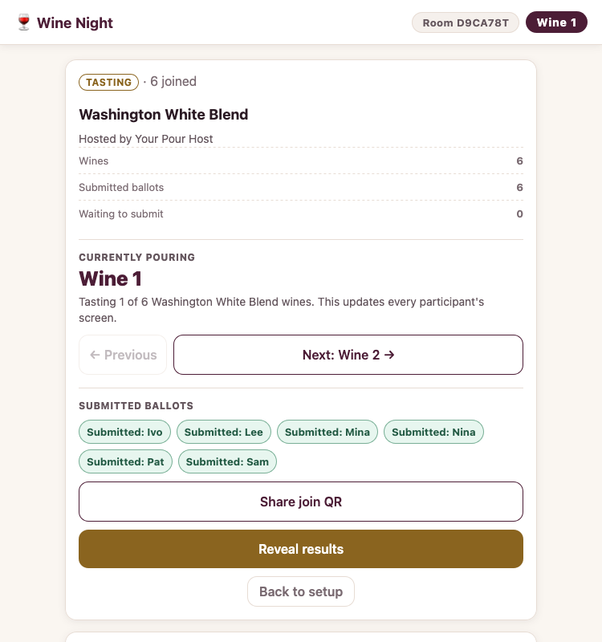
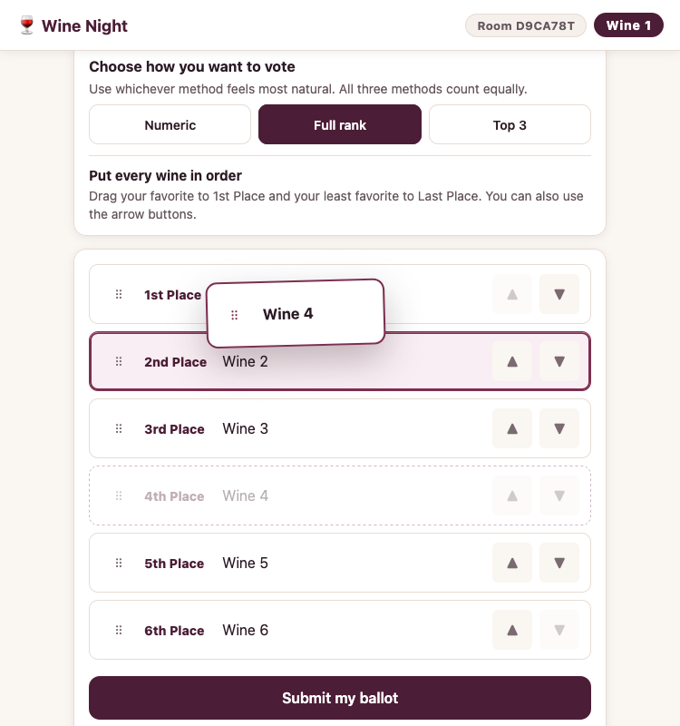
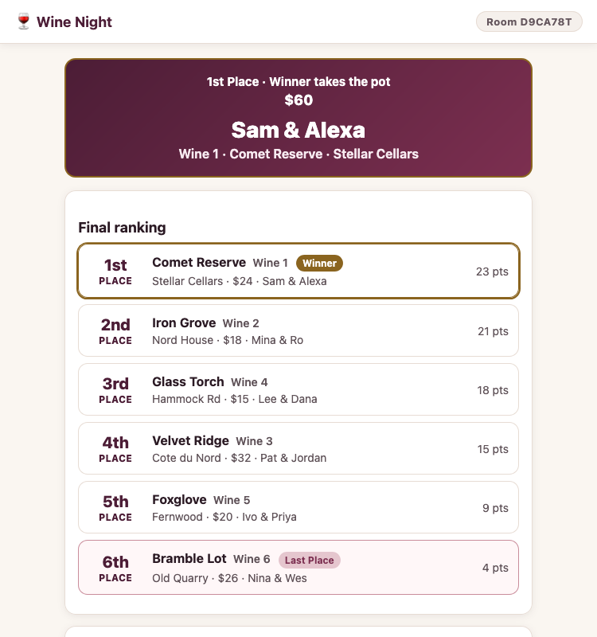

# 🍷 Wine Night

Wine Night is a mobile-friendly blind tasting app for small social events. Each couple can bring a bottle and contribute to the pot, while
every attendee can taste, vote, and keep private notes from their own phone.

## How it works

1. The host creates a room, enters the wines, and starts the tasting.
2. Guests join with the room code and vote using numeric scores, a full ranking, or a top-three ranking.
3. The host locks voting and controls a staged results reveal.

During tasting, bottles are identified as Wine 1, Wine 2, and so on. The number entered during setup should match the number on the bottle's
physical bag.

## Screenshots

| Host controls | Participant ballot | Results reveal |
| :-----------: | :----------------: | :------------: |
| [](docs/screenshots/host.webp) | [](docs/screenshots/vote.webp) | [](docs/screenshots/reveal.webp) |

## Scoring

Raw numeric averages are not comparable when participants use different scales or scoring habits. Wine Night converts each person's ballot
into ranks before combining the results.

- Numeric voters choose their own scale maximum. Equal scores remain tied.
- Full-rank voters order every wine.
- Top-three ballots and incomplete numeric ballots leave the remaining wines tied below the wines that were scored.
- Unranked ties share the average of the remaining Borda positions, keeping the total weight of each ballot equal without inventing
  preferences.
- A Condorcet winner is recognized when one wine beats every other wine in head-to-head comparisons. Otherwise, the Borda totals determine
  the order.

Exact unresolved ties are shown as shared places. The close, clear, and decisive result labels are descriptive summaries, not statistical
significance tests.

## Stats

The reveal combines the final result with shared and private ways to understand how the room voted:

- **Winner and final ranking:** the winning bottle and contributor, optional pot total, shared places for exact ties, and each wine's Borda
  consensus points.
- **Ballot placement distribution:** an anonymous dot plot of every wine's placements, including its average placement and full range.
- **Decisiveness:** a plain-language summary supported by the winner's head-to-head share, Borda margin, ballot count, and whether it is a
  Condorcet winner.
- **Best value:** consensus points per dollar when usable bottle prices were entered.
- **Most consistently placed:** the wine with the lowest rank variance, along with its average placement.
- **Most controversial:** the wine with the highest rank variance, along with its placement range.
- **Most in sync with the group:** the participant whose ranking is closest to the room's consensus.
- **Private tasting profile:** each participant's palate twin, alignment with the group excluding their own ballot, ballot compared with the
  final ranking, saved tasting notes, and numeric scoring range when applicable.

Price-based and person-to-person stats are omitted when the required data or comparable ballots are unavailable.

## Local development

```bash
npm install
npm run dev
```

The local server runs at `http://localhost:8787`.

| Command                            | Purpose                                        |
| ---------------------------------- | ---------------------------------------------- |
| `npm run dev`                      | Start the local Cloudflare development server  |
| `npm test`                         | Run the automated test suite                   |
| `npm run typecheck`                | Validate Cloudflare types and TypeScript       |
| `npm run cf-typegen`               | Regenerate Cloudflare binding types            |
| `npm run deploy`                   | Deploy or update the `workers.dev` version     |
| `npm run deploy:domain -- DOMAIN`  | Deploy or update with a custom domain          |
| `npm run destroy:dry-run`          | Preview deletion of the Cloudflare deployment  |
| `npm run destroy`                  | Delete the live Cloudflare Worker and its data |

## Cloudflare deployment

See [Cloudflare deployment and operations](DEPLOYMENT.md) for initial deployment, custom domains, room backups, restores, monthly
downtime, public-hosting safeguards, and permanent teardown.

## Architecture and privacy

- `src/index.ts`: HTTP API, static assets, authentication, rate limits, and WebSocket routing.
- `src/archive.ts`: versioned host-backup validation and import limits.
- `src/event.ts`: room state in a Durable Object with SQLite storage and caller-scoped live updates.
- `src/scoring.ts`: rank conversion, Borda and Condorcet calculations, Spearman correlation, and result analytics.
- `public/`: dependency-free HTML, CSS, and JavaScript frontend.

Host actions require a random room-specific host key. Each voter receives a separate participant key stored per room and browser tab. Before
reveal, a voter can retrieve only their own ballot and private notes. The complete raw-votes table is host-only.

Inactive rooms expire after 90 days.

## Statistical and voting-method references

- [Borda count overview](https://en.wikipedia.org/wiki/Borda_count): the positional scoring rule used for the main consensus totals.
- [A Borda Count for Partially Ordered Ballots](https://faculty.bard.edu/cullinan/papers/borda_submitted.pdf), Cullinan, Hsiao, and Polett:
  the bucket-averaging treatment used for tied and unranked wines on partial ballots.
- [The Borda Class](https://doi.org/10.1016/j.jmateco.2020.11.001), Terzopoulou and Endriss: an axiomatic analysis of Borda rules for
  top-truncated preferences.
- [Condorcet method overview](https://en.wikipedia.org/wiki/Condorcet_method): the head-to-head criterion used to recognize a wine that
  beats every other wine pairwise.
- [Spearman's rank correlation coefficient](https://en.wikipedia.org/wiki/Spearman%27s_rank_correlation_coefficient): the rank-agreement
  measure used for palate matching and group alignment, with average ranks for ties.

## License

Wine Night is released under the [Zero Clause BSD License](LICENSE) (SPDX: 0BSD).

Copyright &copy; 2026 [Aaron Bull Schaefer][EMAIL] and contributors

[EMAIL]: mailto:aaron@elasticdog.com
